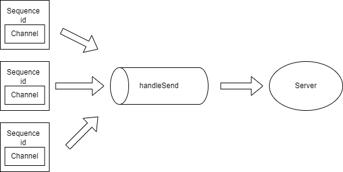
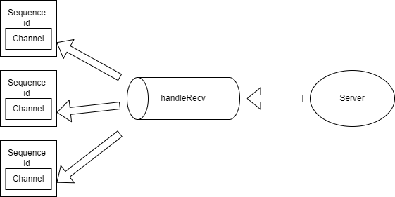

本篇将探讨rpc连接多路复用与多路分解的设计思路与实现。

本系列的相关文章如果没有看的可以先看一下，后面会用到相关的知识。

[通用协程同步原语设计](https://zhuanlan.zhihu.com/p/475554418)

[C++高性能协程RPC框架设计](https://zhuanlan.zhihu.com/p/460646015)

### 问题分析

对于短连接来说，每次发起rpc调用就创建一条连接，由于没有竞争实现起来比较容易，但开销太大。所以本框架实现了rpc连接复用来支持更高的并发。

连接复用的问题在于，在一条连接上可以有多个并发的调用请求，由于服务器也是并发处理这些请求的，所以导致了服务器返回的响应顺序与请求顺序不一致。为了识别请求，我们很容易想到一个方法，就是给每个连接每个请求加上一个唯一的序列号，本框架的做法是在协议头加上序列号字段，具体结构如下

```c
+--------+--------+--------+--------+--------+--------+--------+--------+--------+--------+--------+--------+--------+--------+--------+--------+--------+--------+--------+--------+
|  BYTE  |        |        |        |        |        |        |        |        |        |        |             ........                                                           |
+--------+--------+--------+--------+--------+--------+--------+--------+--------+--------+--------+--------+--------+--------+--------+--------+--------+--------+--------+--------+
|  magic | version|  type  |          sequence id              |          content length           |             content byte[]                                                     |
+--------+--------+--------+--------+--------+--------+--------+--------+--------+--------+--------+--------+--------+--------+--------+--------+--------+--------+--------+--------+

```

第四个字段就是一个32位的序列号，用来识别请求顺序。

解决了请求标识的问题，剩下的问题就是如何收集并发的调用请求，按串行的顺序发送给服务提供方，以及如何将收到的调用结果转发给等待的调用者。即连接的多路复用与多路分解。

### 多路复用



先看一下 `RpcClient` 的大致结构
```cpp
class RpcClient : public std::enable_shared_from_this<RpcClient> 
    using MutexType = CoMutex;
private:
    ...
    /// 序列号
    uint32_t m_sequenceId = 0;
    /// 序列号到对应调用者协程的 Channel 映射
    std::map<uint32_t, Channel<Protocol::ptr>> m_responseHandle;
    /// 保护 m_responseHandle 的 mutex
    MutexType m_mutex;
    /// 消息发送通道
    Channel<Protocol::ptr> m_chan; 
}
```

每个 `RpcClient` 连接对象都有一个不断自增的序列号，一个 `Channel`，一个序列号到对应调用者协程的 `Channel` 映射。

在每个对象连接到服务器时，我们开启了一个 `handleSend` 协程，这个协程的作用是不断从` Channel` 里读取调用请求，转发给服务器。通过上篇所讲的协程同步原语设计，我们知道 `Channel` 内部封装了锁和协程的 `yield`、`resume`。所以我们不用进行加锁就能优雅地收集了调用请求，在 `Channel` 没有消息时会自动挂起，等待请求到达。

```cpp
void RpcClient::handleSend() {
    Protocol::ptr request;
    // 通过 Channel 收集调用请求，如果没有消息时 Channel 内部会挂起该协程等待消息到达
    // Channel 被关闭时会退出循环
    while (m_chan >> request) {
        // 发送请求
        m_session->sendProtocol(request);
    }
}
```

现在看一下比较重要的 `call` 方法也就是调用者使用的方法，`call` 里会开启一个 `Channel` 用于接收调用结果，将请求序列号与 `Channel` 关联起来放入 `m_responseHandle`。然后创建调用请求通过 `Channel` 向 ` handleSend` 协程发送请求。之后就通过自己的 `Channel` 挂起协程，等待调用结果。

```cpp
template<typename R>
Result<R> RpcClient::call(Serializer::ptr s) {
    Result<R> val;
    ...
    // 开启一个 Channel 接收调用结果
    Channel<Protocol::ptr> recvChan(1);
    // 本次调用的序列号
    uint32_t id = 0;

    {
        MutexType::Lock lock(m_mutex);
        id = m_sequenceId;
        // 将请求序列号与接收 Channel 关联
        m_responseHandle.emplace(m_sequenceId, recvChan);
        ++m_sequenceId;
    }

    // 创建请求协议，附带上请求 id
    Protocol::ptr request =
    	Protocol::Create(Protocol::MsgType::RPC_METHOD_REQUEST,s->toString(), id);

    // 向 send 协程的 Channel 发送消息
    m_chan << request;

    ...

    Protocol::ptr response;
    // 等待 response，Channel内部会挂起协程，如果有消息到达或者被关闭则会被唤醒
    recvChan >> response;

    ...

    Serializer serializer(response->getContent());
    serializer >> val;

    return val;
}
```

这就是多路复用的设计，并发的调用请求通过 `Channel` 不用显式进行同步操作就能向 `handleSend` 协程发送请求， `handleSend`协程不断收集请求转发给服务器。

### 多路分解


接着讲讲多路分解。多路分解和多路复用就是一个相反的过程，具体就是如何将服务器的响应解析，转发给对应的调用者。

同样的，在每个rpc对象连接到服务器时，我们也开启了一个 `handleRecv` 协程用于接收服务器的消息，并且从中解析出响应类型进行对应的处理。

```cpp
void RpcClient::handleRecv() {
    while (true) {
        // 接收响应
        Protocol::ptr response = m_session->recvProtocol();
        ...
        // 获取响应类型    
        Protocol::MsgType type = response->getMsgType();
        // 判断响应类型进行对应的处理
        switch (type) {
            // 心跳处理    
            case Protocol::MsgType::HEARTBEAT_PACKET:
                ...
                break;
            // 调用结果处理
            case Protocol::MsgType::RPC_METHOD_RESPONSE:
                handleMethodResponse(response);
                break;
            ...    
            default:
                ...
                break;
        }
    }
}
```

我们看一下对服务器返回调用结果的处理。我们先获取该调用结果的序列号，这个序列号标识着一个之前已经发过的调用请求。然后查找该序列号对应的 `Channel` 是否还存在，如果调用超时到达，或者之前的调用请求已经被处理，则忽略本次调用结果。通过序列号获取等待该结果的 `Channel` ，并发送调用结果唤醒调用者，完成多路分解。

```cpp
void RpcClient::handleMethodResponse(Protocol::ptr response) {
    // 获取该调用结果的序列号
    uint32_t id = response->getSequenceId();
    std::map<uint32_t, Channel<Protocol::ptr>>::iterator it;

    MutexType::Lock lock(m_mutex);
    // 查找该序列号的 Channel 是否还存在，如果不存在直接返回
    it = m_responseHandle.find(id);
    if (it == m_responseHandle.end()) {
        return;
    }
    // 通过序列号获取等待该结果的 Channel
    Channel<Protocol::ptr> chan = it->second;
    // 对该 Channel 发送调用结果唤醒调用者
    chan << response;
}
```

### 最后

虽然单连接的rpc实现起来相对复杂一些，要在应用层面要实现多路复用的功能。但资源的利用率远远大于短连接，就性能而言，可发送和处理的消息数也比短连接多得多，这对一个高性能的rpc框架是必备的。

最新代码已经更新到GitHub上了

[zavier-wong/acid: A high performance fiber RPC network framework. 高性能协程RPC网络框架 (github.com)](https://github.com/zavier-wong/acid)